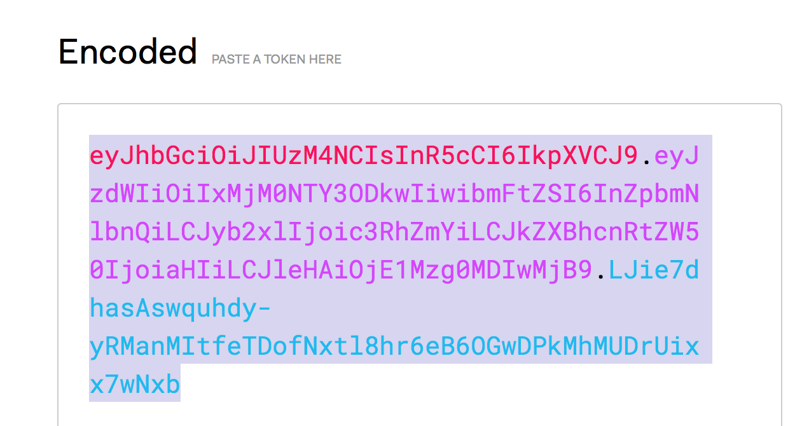

# stack-conf-exercises

The code is written in ReactJS, NodeJS and Express for STACK Developer Conference 2018.

# Exercise 1
Make a GET call to the `/verifytoken` endpoint.

## Setup
- `git clone` this library
- Navigate to the root folder of the project
- Restore dependencies with `npm install`
- Run `npx nodemon` 
- The server will be running on `http://localhost:9000/`

## Todo
1. Use Postman (https://www.getpostman.com/) tested with v6.3.0 to make a GET request http://localhost:9000/verifytoken

You should get the error: `No Authorisation header with Bearer token found.`

Should look like this:

2. The server is expecting an authorisation header with a JWT. Get the jwt from `bit.ly/jwt-ex-1` which is under the `Encoded` part

Like this:

3. Copy the JWT and add a Authorisation header: Bearer {JWT} to your request

Should look like this:

You should get the error: `Oops, you are NOT authorised to view this page because: invalid signature`

4. Seems like the secret is wrong. Paste the correct secret into jwt.io to regenerate a new JWT

5. Use the correct JWT to make the request again

You should get the error: `Oops, you are NOT authorised to view this page because: jwt expired`

6. Seems like the jwt has expired. Adjust the `exp` field in jwt.io and try again.

7. You should get `Congrats, you are authorised to view this page.`

# Exercise 2
This repo contains a **Ticket Purchasing Interface** (localhost:3000) and a **Ticketing Machine** (authorisation server at localhost:9000) which creates a JWT token (embeded in a ticket). 

To enter the Amusement Park, the user needs to pass the correct JWT generated by the Ticketing Machine (on your local machine) to the **Amusement Park Gantry** (hosted online) in order to be allowed access through the gantry. 

In this exercise, you will generate and sign your own jwt locally using this library (https://github.com/auth0/node-jsonwebtoken) and use it to make a request to the Amusement Park Gantry server at `stack-conf-jwt.herokuapp.com/api/park/entries`. 

## Setup
- `git clone` this library (if you have not already done so)

#### Setup Ticketing Machine Server
- Open a terminal in the root folder
- Restore dependencies with `npm install`
- Run `npx nodemon` to start the ticketing machine server
- The ticketing machine will be running on `http://localhost:9000/`

#### Setup Ticket Purchasing Interface
- Open a new terminal and `cd client`
- Restore dependencies with `npm install`
- Then run `npm start` to run the client interface
- Access the client interface on `http://localhost:3000/` 

## Structure
- `~/client` contains the **Ticket Purchasing Interface** app and frontend assets
- `~/server` contains the **Ticketing Machine** express server and its apis

## Todo
Help fix the broken ticketing machine for an amusement park.

#### 2a) Add Missing Token Signing Configurations
1. Update the code in `routes/create.js` with JWT configuration options to be:

    - algorithm - HS384
    - expiresIn - 1 hour

    To find out how to add the options required, reference the readme of our [JWT library used](https://github.com/auth0/node-jsonwebtoken).

    This ensures that we are using HS384 algorithm to sign the JWT and that the JWT should expire in 1 hour.

2. Start ticketing server (http://localhost:9000) and visit http://localhost:3000 to view create ticket page

3. Click `Create Ticket` to generate a ticket. You should be able to see your ticket generated.

Like this:

#### 2b) Test out your Generated Token
1. Test out your generated ticket against the amusement park gantry system (source at https://github.com/yuhong90/stack-jwt-demo-server). 
By clicking 'Insert Ticket into Gantry', We make an API request to `stack-conf-jwt.herokuapp.com/api/park/entries`.

2. We should get an error which says that certain claims are missing. 

#### 2c) Add Missing Token Payload Claims
1. Fix it by configuring the correct claims in the code payload:
    - Issuer - 'stackconf-auth-service'
    - Audience - 'stackconf-api-service'
    - Subject - 'yourname'
    - Type: 'vip-ticket'

    *Hint 1: Check out the [registered claims section of the open standards of JWT](https://tools.ietf.org/html/rfc7519#section-4.1) on how to define a registered claim in your payload. Alternatively, you may also use the helpful signing options provided by the [JWT library](https://github.com/auth0/node-jsonwebtoken#jwtsignpayload-secretorprivatekey-options-callback) used in this exercise.*

    *Hint 2: One of the claims is a [private claim](https://tools.ietf.org/html/rfc7519#section-4.3) and require manual adding to token payload.*

2. Click ‘Insert Ticket into Gantry’ to send your JWT token and gain entry to the amusement park.

## Food for thought - Questions to think about:
1. How do I use a private/public key pair instead of using HMAC? What would have to change?
2. What happens if the expiration time is longer/shorter?
3. What happens if i want to revoke the access?

## Some useful reads:
- https://tools.ietf.org/html/rfc7519
- https://blog.gds-gov.tech/our-considerations-on-token-design-session-management-c2fa96198e6d
- https://jwt.io/introduction/
- https://auth0.com/docs/jwt
- https://auth0.com/blog/stateless-auth-for-stateful-minds/
